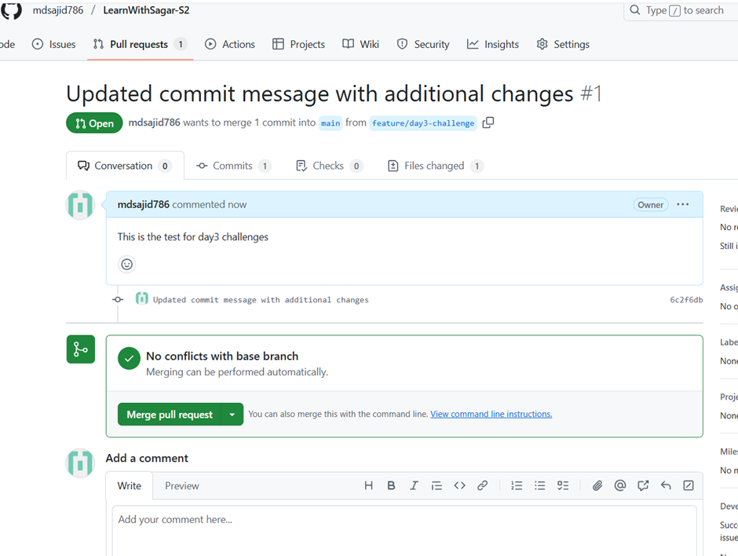
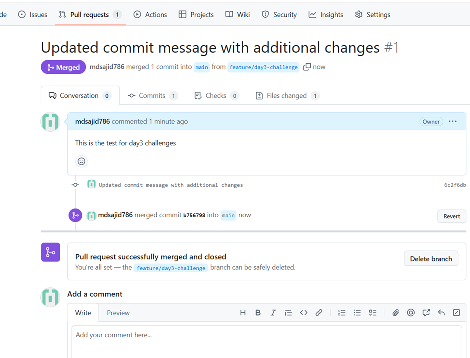

Installed GIT in local
Configured GIT & GITLab 
Cloned reposotory 
    - git clone https://github.com/Sagar2366/LearnWithSagar.git

Configure Git: Set up your username and email.
    - git config --global user.name "mdsajid786"
    - git config --global user.email "mdsajid020@gmail.com"

Created Branch
    - git checkout -b feature/day3-challenge   
      Switched to a new branch 'feature/day3-challenge'
    - git branch
        * feature/day3-challenge
          main

Made some changes in the feature branch

Staged the changes  
    - git add
    - git commit -m "Added new fetures in the new branch"

Verify the current branch (HEAD position):
    - git rev-parse --abbrev-ref HEAD
      feature/day3-challenge

pushed the changes
    - git push origin feature/day3-challenge   
        Enumerating objects: 3, done.
        Counting objects: 100% (3/3), done.
        Delta compression using up to 22 threads
        Compressing objects: 100% (2/2), done.
        Writing objects: 100% (2/2), 328 bytes | 164.00 KiB/s, done.
        Total 2 (delta 0), reused 0 (delta 0), pack-reused 0 (from 0)
        remote: 
        remote: Create a pull request for 'feature/day3-challenge' on GitHub by visiting:
        remote:      https://github.com/mdsajid786/LearnWithSagar-S2/pull/new/feature/day3-challenge
        remote:
        To https://github.com/mdsajid786/LearnWithSagar-S2.git
        * [new branch]      feature/day3-challenge -> feature/day3-challenge

Created PR & Merged the PR

Next, added few more lines from another Git account and resolved git conflicts and pulled the latest changes and merged

    git checkout main
    git pull origin main
    git checkout feature/day3-challenge
    git merge main

Deleted Git feture branch locally and remotely. 

    - git branch -d feature/day3-challenge
        Deleted branch feature/day3-challenge (was b756798).

    - git push origin --delete feature/day3-challenge
        To https://github.com/mdsajid786/LearnWithSagar-S2.git
        - [deleted]         feature/day3-challenge

Commit Logs:

    - git log --oneline
        b756798 (HEAD -> main, origin/main, origin/HEAD) Merge pull request #1 from mdsajid786/feature/day3-challenge
        6c2f6db Updated commit message with additional changes
        e9f771e Update Challeges.md
        8b0ce42 Create Challeges-Response.md
        df6f1ee Update Challeges.md
        5489b3f updated
        8a106a9 first commit

    - git log --pretty=format:"%h - %an, %ar : %s"
        b756798 - Sajid Mohammad, 37 minutes ago : Merge pull request #1 from mdsajid786/feature/day3-challenge
        6c2f6db - mdsajid786, 40 minutes ago : Updated commit message with additional changes
        e9f771e - Sajid Mohammad, 12 hours ago : Update Challeges.md
        8b0ce42 - Sajid Mohammad, 12 hours ago : Create Challeges-Response.md
        df6f1ee - Sajid Mohammad, 12 hours ago : Update Challeges.md
        5489b3f - mdsajid786, 13 hours ago : updated
        8a106a9 - mdsajid786, 14 hours ago : first commit

    - git log --stat
        commit b75679874358be984ddddaba2bc4a782027d0572 (HEAD -> main, origin/main, origin/HEAD)
        Merge: e9f771e 6c2f6db
        Author: Sajid Mohammad <mdsajid020@gmail.com>
        Date:   Thu Apr 10 06:51:42 2025 +0530

            Merge pull request #1 from mdsajid786/feature/day3-challenge

            Updated commit message with additional changes

